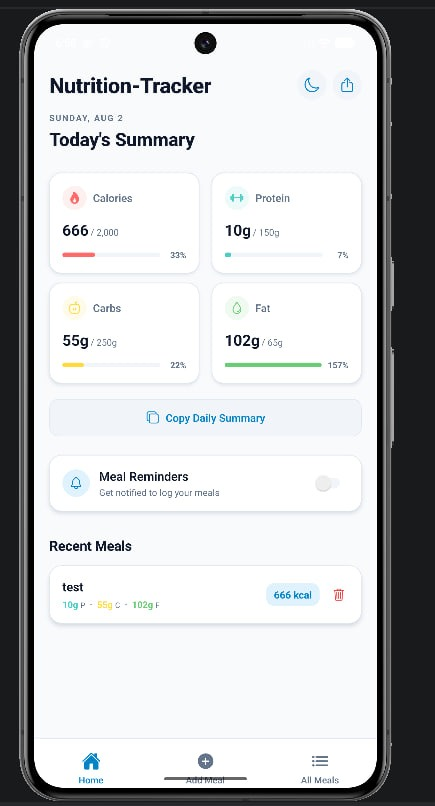
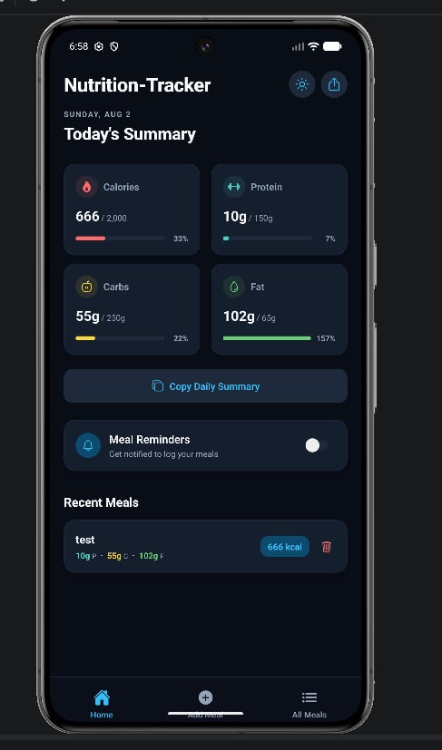
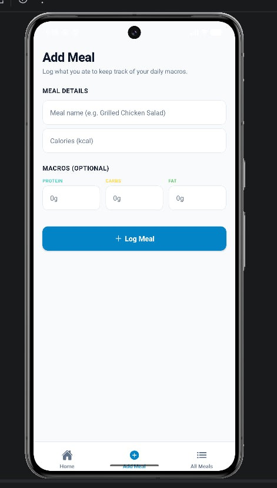
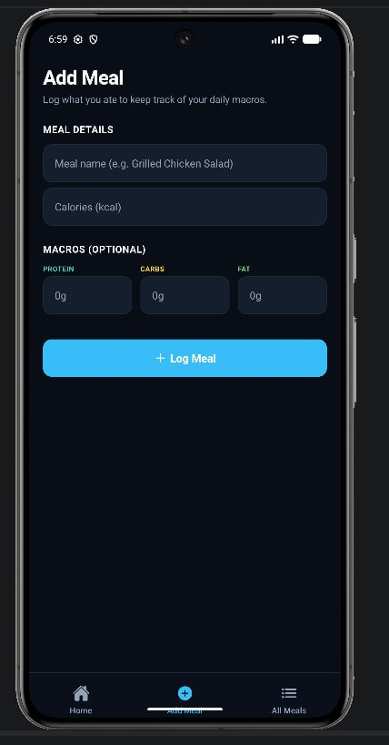
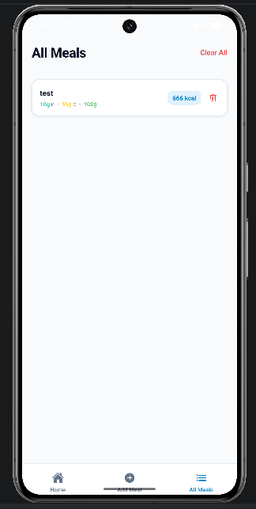
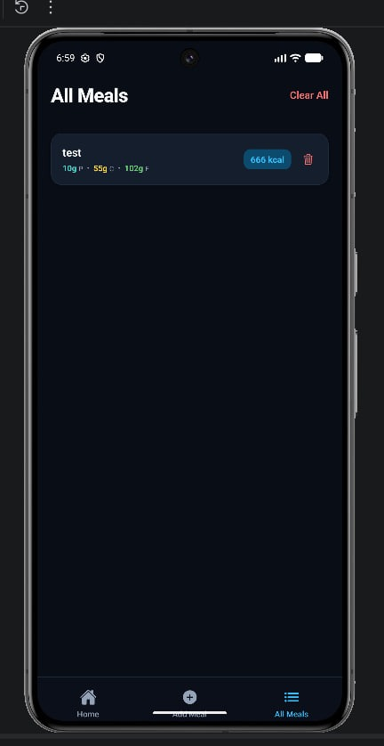

# Nutrition Tracker

A modern, high-fidelity mobile application built with React Native and Expo, designed to help users track daily caloric intake, monitor macronutrient distributions (proteins, carbohydrates, and fats), and build healthier dietary habits. The application features a premium user interface with seamless adaptive dark and light themes, local notifications, copy-to-clipboard summary generation, and persistent data storage.

---

## Interface Showcase

Below is a side-by-side comparison of the application interface under both light and dark system configurations.

### Light and Dark Theme Comparison

| Screen | Light Theme | Dark Theme |
| :--- | :---: | :---: |
| **Home Dashboard** |  |  |
| **Log Meal Form** |  |  |
| **Meal History** |  |  |

---

## Core Capabilities

* **Dynamic Macronutrient Visualization:** Real-time feedback on daily targets for Calories, Protein, Carbs, and Fats using native progress indicators.
* **Unified Theme Engine:** Dynamic dark and light styling options crafted with tailored color palettes for maximum readability and visual appeal.
* **Granular Meal Logging:** Quick entry modal/form to register meal names, calories, and optional carbohydrate, protein, and fat distributions.
* **Structured Clipboard Export:** Generates a formatted text summary of your daily nutritional intake, ready to be shared with trainers or logged elsewhere.
* **Intelligent Reminders:** Integrated push notification toggles to prompt daily meal logging.
* **Persistent Offline Storage:** High-performance local storage powered by Async Storage ensures data is preserved securely on-device.

---

## Technology Stack

This project utilizes the following modern tools and frameworks:
- **React Native & Expo (v57):** Cross-platform mobile development framework.
- **Expo Router:** File-based navigation system for clean, routing-based page architectures.
- **TypeScript:** Typed JavaScript extension for enhanced development reliability and compile-time safety.
- **React Native Reanimated:** Declarative animations framework for smooth transition gestures.
- **Expo Notifications:** Local push notification reminders scheduling.
- **Async Storage:** Persistent asynchronous key-value data storage on-device.

---

## Technical Specifications & Getting Started

### System Prerequisites

Ensure you have Node.js and npm installed on your workstation.

### Installation Walkthrough

1. Clone the project repository:
   ```bash
   git clone <repository-url>
   cd nutrition-tracker
   ```

2. Retrieve local dependencies:
   ```bash
   npm install
   ```

### Execution

Launch the local development workspace:
```bash
npx expo start
```

Use the terminal commands to target your preferred environment:
- **Android Emulator:** Press `a`
- **iOS Simulator:** Press `i`
- **Web Interface:** Press `w`
- **Physical Device:** Scan the displayed QR code using the Expo Go companion application.

---

## Asset Customization for Production APK Builds

To configure a custom app logo that displays correctly on the device launcher post-installation:

### 1. Preparation of Asset Specifications
Verify that your graphic assets meet the following criteria:
- **Default Application Icon:** Square PNG, exactly 1024x1024 pixels.
- **Android Adaptive Foreground:** Transparent PNG, 1024x1024 pixels. Place critical icon graphics inside the safe zone (central 66% circle) to prevent cropping across launcher shapes.
- **Android Adaptive Background:** PNG, 1024x1024 pixels (e.g., solid color, texture, or pattern).

### 2. File Location Setup
Overwrite the default placeholder assets in the assets directory:
- Place the general icon at: `assets/images/icon.png`
- Place the Android adaptive foreground image at: `assets/images/android-icon-foreground.png`
- Place the Android adaptive background image at: `assets/images/android-icon-background.png`

### 3. Application Configuration Update
Ensure your configuration in `app.json` maps to the specified asset paths:
```json
{
  "expo": {
    "icon": "./assets/images/icon.png",
    "android": {
      "adaptiveIcon": {
        "backgroundColor": "#E6F4FE", 
        "foregroundImage": "./assets/images/android-icon-foreground.png",
        "backgroundImage": "./assets/images/android-icon-background.png"
      }
    }
  }
}
```
*Note: If a background image is not desired, omit the `backgroundImage` property and specify a hex code in `backgroundColor`.*

### 4. Build Initiation
Execute the production preview build via EAS (Expo Application Services):
```bash
eas build -p android --profile preview
```

---

## License

This software is distributed under the MIT License. Refer to the LICENSE file for details.
